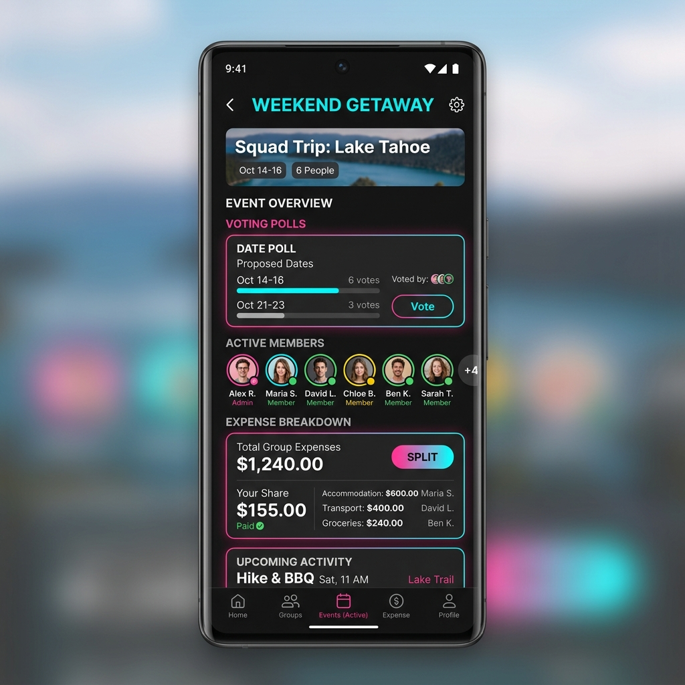
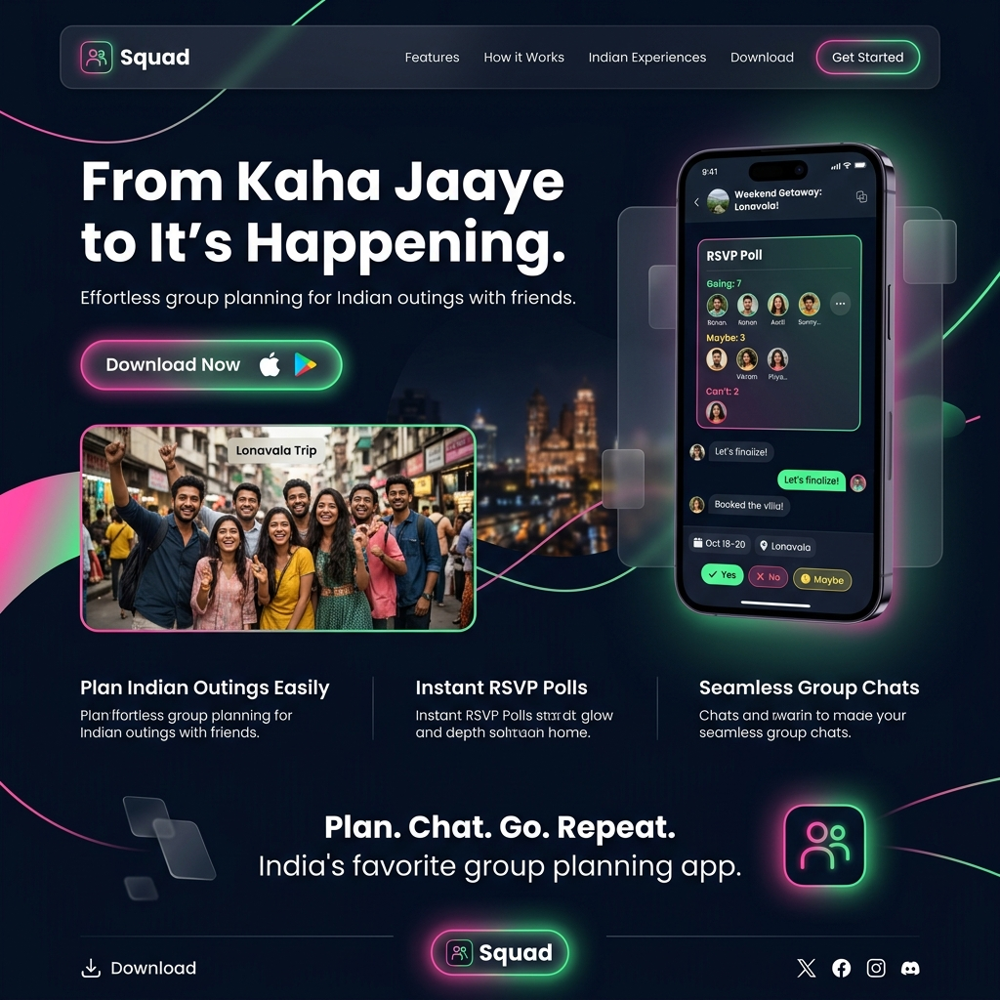

# 🚀 Squad — Group Hangout Planner

> **From "Kaha Jaaye?" to "It's Happening!" 🥂**
> The India-first, mobile-first social planner that takes your inner circle from chaotic WhatsApp threads to locked-in venues, seamless polls, and easy UPI bill splits.

[](https://flutter.dev)
[](https://nextjs.org)
[](https://firebase.google.com)
[](#)

<div align="left">
  <a href="https://play.google.com/store/apps/details?id=com.squad.app.squad" target="_blank">
    
  </a>
  <a href="https://github.com/uday-kiran9147/squad_manager" target="_blank">
    
  </a>
</div>

---

## 📸 Sneak Peek

### Mobile App (Flutter)


### Web Fallback & Landing Page (Next.js)


---

## 💡 The Core Problem

Let's face it: **WhatsApp handles communication, not planning.**
When an Indian friend group wants to hang out, they spend 2–3 days in chaotic WhatsApp threads scrolling past hundreds of messages trying to agree on one date, time, and venue. People drop out, calculations get messy, and plans end up in the graveyard.

**Squad is the dedicated home for your friendship.** It brings together availability polling, venue selection, and UPI-native bill splitting into one beautiful, hyper-social app experience.

---

## 👥 Target Personas

Squad is designed around the three key roles found in every Indian friend group:

| Persona | Role | Key Frustrations | How Squad Solves It |
|---|---|---|---|
| **Primary: The Organizer** 👑 | The one who "makes things happen." Often college students/early-career professionals (18–26). | Tired of chasing replies in group chats, being seen as "bossy," or manually tallying up votes. | **Simple planning interface:** Set up 3–5 dates and venues, send a quick invite, and let the app handle automated alerts and count votes. |
| **Secondary: The Invitee** ⚡ | The friends in the group who just want to show up. | Doesn't want to download *another* app just to vote or RSVP for a single dinner. | **Zero-Friction Web Fallback:** Click the WhatsApp link and vote/RSVP instantly on a gorgeous web page without installing anything. |
| **Tertiary: The Payer** 💳 | The one who fronts the money (e.g. entry tickets, cabs, dinner bill). | Copy-pasting UPI IDs, sending manual reminders, or maintaining painful Excel sheets/Splitwise records. | **Native UPI Split Links:** Equal division calculations powered by Firestore, creating direct deep links (`GPay`, `PhonePe`, `Paytm`) for instant settlement. |

---

## ✨ Features Highlight

### 📅 Availability & Venue Polls
Organizers can suggest multiple date options and venues. Members tap to vote. Once a consensus is reached, the organizer locks the plan, triggering instant push notifications.

### 🔗 Zero-Friction Web Fallback (`squad_web`)
Low friction is the key to getting a 100% headcount. Non-installers see a responsive, beautiful web preview where they can vote and RSVP. Tap. Vote. Confirmed.

### 💸 Native UPI Splits
Add expenses in INR (e.g., "Cab to Hauz Khas" or "Dinner at Soho"). Squad automatically calculates equal shares and generates specialized UPI deep links to launch local banking apps directly to the payer's address.

### 📸 The "Memory Feed"
To keep outings alive, Squad features a post-plan photo dump. 48 hours after a plan completes, the shared photo gallery unlocks, prompting everyone to post their favorite snapshots and relive the outing.

---

## 🏗️ Repository Architecture

This is a monorepo consisting of the mobile application and its corresponding web companion:

```
square_manager/
├── squad/               # 📱 Flutter Mobile Application (iOS & Android)
│   ├── android/         # Native Android codebase
│   ├── ios/             # Native iOS codebase
│   ├── lib/             # Flutter core logic & features
│   │   ├── app/         # App configuration & GoRouter routes
│   │   ├── core/        # Shared models, services, & design tokens
│   │   └── features/    # Modular screens (auth, plan, expenses, profile)
│   └── pubspec.yaml     # Flutter package specifications
│
└── squad_web/           # 🌐 Next.js Web Fallback & Landing Page
    ├── src/app/         # Next.js App Router (child-safety, terms, landing)
    ├── public/          # Static assets
    └── package.json     # Node dependencies
```

---

## 🛠️ Project Setup & Installation

### Prerequisites
* **Flutter SDK**: `^3.35.7`
* **Dart SDK**: `^3.0.0`
* **Node.js**: `^18.x` or higher
* **Package Managers**: `npm`, `yarn` or `pnpm`
* **Firebase CLI**: Installed and configured with your Google account

---

### 📱 1. Setting up the Flutter App (`squad/`)

1. **Navigate to the Flutter directory**:
   ```bash
   cd squad
   ```

2. **Install Flutter Dependencies**:
   ```bash
   flutter pub get
   ```

3. **Configure Firebase**:
   * Create a Firebase project at the [Firebase Console](https://console.firebase.google.com/).
   * Copy `lib/firebase_options_template.dart` to a new file named `lib/firebase_options.dart` and enter your specific Firebase web, iOS, and Android keys.
   * Place `google-services.json` in `android/app/` and `GoogleService-Info.plist` in `ios/Runner/`.

4. **Run Code Generation** (Uses Freezed, JSON Serializable, and Build Runner):
   ```bash
   flutter pub run build_runner build --delete-conflicting-outputs
   ```

5. **Launch the application**:
   * Connect a physical mobile device or simulator.
   * Run the command:
     ```bash
     flutter run
     ```

---

### 🌐 2. Setting up the Web Landing & Fallback (`squad_web/`)

1. **Navigate to the Next.js directory**:
   ```bash
   cd squad_web
   ```

2. **Install Web Dependencies**:
   ```bash
   npm install
   # or
   yarn install
   ```

3. **Environment Setup**:
   * Create a `.env.local` file at the root of `squad_web/` matching your Firebase configuration if you are fetching Firestore/Auth values directly from the web client.

4. **Launch the development server**:
   ```bash
   npm run dev
   ```
   * Open `http://localhost:3000` to preview the beautiful modern landing page.

5. **Build for Production**:
   ```bash
   npm run build
   ```

---

## 🔒 Security & Best Practices

* **No Tracked Credentials**: Real Firebase configurations and `.env` files are ignored in `.gitignore` to prevent exposure. Check out `squad/lib/firebase_options_template.dart` to see the expected setup.
* **OTP Auth**: Robust phone number verification through Firebase Authentication ensures only legitimate phone users can coordinate within private squads.
* **UPI Generation safety**: No payment information or bank accounts are saved directly on the database. Custom deep links are formulated on-the-fly inside the secure client sandbox using Firestore transactions.
